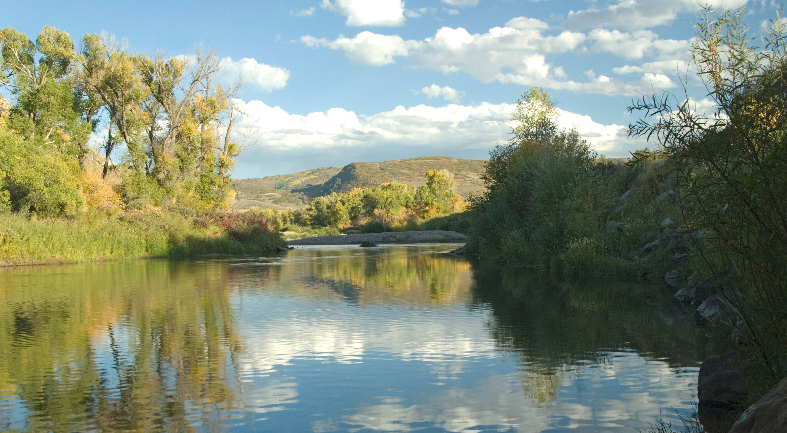

```{r setup, include=FALSE}
############################################
#load libraries
############################################
library(knitr)
knitr::opts_chunk$set(echo = FALSE, message = FALSE, warning = FALSE)
library(tufte)
library(rmarkdown)
library(prettydoc)
library(kableExtra)
library(bookdown)
library(ggplot2)
library(tidyverse)
library(gapminder)
library(urltools)
library(leaflet)
library(htmltools)
library(ggiraph)
library(ggiraphExtra)
library(png)
library(sunburstR)
library(d3r)
library(shiny)
library(shinymaterial)
library(flexdashboard)
############################################
#load and format data
############################################

#load station names and abbreviations
fname <- "./data/station_abbreviations.csv"
abbv <- read.csv(fname, header = TRUE)

fname = "./data/trendStationTable.csv"
trendStationTable <- read.csv(fname, header = TRUE, check.names = FALSE, colClasses = c("character", "character", "numeric","numeric","numeric","numeric"))

#load the trend results
fname = "./data/significantTrends.csv"
significantTrends = read.csv(fname, header = TRUE) %>%
  mutate(
    pct_change = abs(trend/median)*100
  ) %>%
  left_join(., abbv, by = c("station" = "Station_ID")) %>%
  mutate(
    tooltip = paste0(
      station_nm, "<br>",
      "Metric: ", Description, "<br>",
      "Trend Direction: ", trend_direction, "<br>",
      "Change Per Year: ", round(pct_change, 2), "%<br>",
      "Statistical Significance (p-value): ", round(sig, 3))
  )

#load the model validation outputs
fname <- "./data/significantStats_Wilcox.csv"
sig_wilcox_out = read.csv(fname, header = TRUE) %>%
  left_join(., abbv, by = c("station" = "Station_ID")) %>%
  mutate(
    tooltip = paste0(
    station_nm, "<br>",
    "Metric: ", Description, "<br>",
    "Model Error Direction: ", direction, "<br>",
    "Difference from Observed: ", round(pctDiff, 2), "%<br>",
    "Statistical Significance (p-value): ", round(pval, 3)
    )
  )

#load the metric difference counts
fname <- "./data/significant_model_differences.csv"
sig_diffs = read.csv(fname, header = TRUE)

#load the coded diversion record analysis results
fname = "./data/diversionRecords.csv"
Diversion.Records = read.csv(fname, header = TRUE)

#load the IHA results
fname = "./data/IHA_results.csv"
iha_out = read.csv(fname, header = TRUE)

#load the IHA aggregated counts
fname = "./data/IHA_table.csv"
iha_risks = read.csv(fname, header = TRUE) %>%
  filter(Count != 0)  %>%
  dplyr::select(Risk, SubType, Type, Count)

fname = "./data/annualVolumes.csv"
annualVolumes = read.csv(fname, header = TRUE)

#load the final analysis outputs
fname = "./data/full_output_table.csv"
final_out = read.csv(fname, header = TRUE) %>%
  mutate(
    WFET_troutRisk = factor(WFET_troutRisk, levels = c("very high", "high", "moderate", "low", "minimal"), ordered = TRUE),
    WFET_warmFishRisk = factor(WFET_warmFishRisk, levels = c("very high", "high", "moderate", "low", "minimal"), ordered = TRUE),
    WFET_confinedRiparianRisk = factor(WFET_confinedRiparianRisk, levels = c("very high", "high", "moderate", "low", "minimal"), ordered = TRUE),
    WFET_unconfinedRiparianAbundance_risk = factor(WFET_unconfinedRiparianAbundance_risk, levels = c("very high", "high", "moderate", "low", "minimal"), ordered = TRUE),
   WFET_unconfinedRiparianRecruitment_risk = factor(WFET_unconfinedRiparianRecruitment_risk, levels = c("very high", "high", "moderate", "low", "minimal"), ordered = TRUE)
  )

focus_area = final_out$stateMod_node
```

<br><br>

<div class="mycontent">

***

It can be argued that over the course of human history, no natural resource is more closely linked to the rise and fall of empires than water. From the sudden collapse of the ancient [Akkadian Empire](https://www.ncdc.noaa.gov/abrupt-climate-change/Drought%20and%20the%20Akkadian%20Empire), to the mysterious decline of [Ankor Wat](https://www.pnas.org/content/107/15/6748) and the [fall of Rome](https://www.smithsonianmag.com/science-nature/how-climate-change-and-disease-helped-fall-rome-180967591/), lessons abound for the tight dependence of human societies on water availability and sustainable resource management. While it may be difficult to see ourselves affected by the same situational dependencies as men and women who wore togas and were entertained by chariot races, exceptional multi-year drought conditions and a coming water management crisis on the Colorado River are putting our own institutions, infrastructure systems, and resource management frameworks to the test. Weathering the changes ahead and strategically plotting our own course through challenging times requires careful consideration of recent streamflow trends and some understanding of the relationships between existing water uses, streamflow behaviors, and various human and environmental needs.  

***
<center>
> "In the empire of desert, water is the king and shadow is the queen." 
>
> `r tufte::quote_footer('--- Murat ildan')`

</center>
***

This interactive webpage provides an opportunity for interested users to learn about these topics. Specifically, the discussions below touch on long-term trends observed at streamflow gauging stations, characteristic behaviors of streamflow (e.g. peak flows, minimum flows, etc.) across different hydrological year types and a different locations in the basin, potential limiting factors for native and sport fish, recreational boating opportunities, and other issues of concern in the Yampa River basin. The information provided here is intended to help stakeholders and interested parties identify acute risks and contemplate opportunities to better meet environmental and recreational water use needs now and in the future. This is not an exhaustive technical discussion. If you are looking for the nitty-gritty details, you will need to look elsewhere.
## Historical Trends in Streamflow Behavior

What will streamflows in the Yampa River basin look like in 5 years? In 10? That is a million-dollar question, indeed. The [Magic 8-Ball](https://en.wikipedia.org/wiki/Magic_8-Ball) says "Without a Doubt". Decidedly not helpful. The draw of the tarot cards produced the Hanged Man. We're not sure what that means but it doesn't sound good. We don't seem to be getting anywhere. Fortunately, looking to the recent past can help us understand what conditions might look like in the near future. 

Historical trends were explored at a selection of streamflow gauging locations in the Yampa River basin. Only locations boasting a 20+ year record over the period between 1992-2020 were included. Relegating the analysis to only gauges with a relatively long period of record and restriction of the assessed period to recent years accomplished two goals:

* Use of the recent data period makes our results comparable to a [recent analysis completed by the United States Geological Survey (USGS)](https://doi.org/10.3133/sir20215016); and
* Exclusion of sites with short data collection periods boosts our confidence that the upward or downward trends we observe represent long-term shifts in hydrological behavior as opposed to short-term changes in weather. 

Use of these criteria resulted in evaluation of streamflow records at nine USGS gauging stations from across the upper Yampa River watershed. In aggregate, these nine locations reflect conditions in small headwater drainages, moderately sized creeks, and large mainstem river segments across diverse settings with unique geology, biology, and land use. 


```{r trend stations, results = 'as is'}
kbl(trendStationTable, caption = "Table: Streamflow gauging stations included in the trends analysis.") %>%
  kable_styling(bootstrap_options = c("striped", "hover", "responsive"), font_size = 12)
```


For the more wonkish among you, trends were assessed using a Mann-Kendall test on streamflow time series subjected to a [pre-whitening procedure to remove lag-1 auto-correlation](https://doi.org/10.1002/hyp.1095). You can read more about that the benefits of that approach elsewhere. I will spare the non-technical reader any further digression. What I can tell you is that the analysis identified numerous significant trends in streamflow behavior at eight of the nine locations considered. Long-term changes in streamflow can be driven by changes in precipitation, temperatures, agricultural/municipal/industrial water use and/or reservoir management. All of these influences may play some part in driving the trends apparent in the historical record. 

Trend results are a bit of a mixed bag. In the upper watershed, positive trends are evident in metrics characterizing spring streamflow conditions. In the lower watershed and below Stagecoach Reservoir, negative trends in metrics related to fall streamflow patterns are evident. The stream gauge on Elkhead Creek showed the most pervasive downward trends in winter and spring streamflow characteristics. Feel free to use the interactive figure below to explore the analysis results. 


```{r trends, out.width = '100%', fig.cap='Figure: Upward (teal) and downward (red) changes in a variety of streamflow metrics for a selection of stream gauges located in the Yampa River Basin. The larger the triangle, the larger the upward or downward trend in that flow behavior. A more opaque symbol indicates a more certain result. Only stations where statistically significant trends were observed are included here. Mouse over the plot for more detailed information about any given observed trend.'}

#plot trend results
p <- ggplot(significantTrends) +
  geom_point_interactive(aes(x = Station_Abbr, y = Description, size = pct_change, color = trend_direction, shape = trend_direction, alpha = sig, tooltip = tooltip, data_id = tooltip)) +
  scale_x_discrete(labels = function(x) str_wrap(x, width = 10)) +
  scale_alpha_continuous(name = "Trend Significance \n(p-value)", trans = 'reverse', guide = guide_legend(override.aes = list(color = "red") )) +
  scale_shape_manual(name = "Trend Direction", values = c(25, 24)) +
  scale_color_discrete(name = "Trend Direction") +
  scale_size_continuous(name = "Change Per Year (%)", guide = guide_legend(override.aes = list(shape = 24) )) +
  xlab("USGS Streamflow Gauge") +
  ylab("Hydrological Regime Metric") +
  theme(legend.position="bottom", legend.box = "vertical", legend.text = element_text(size = 8), axis.text.x = element_text(angle = 45, vjust =1, hjust=1, size = 8), axis.text.y = element_text(size = 8), axis.title=element_text(size=9), legend.title = element_text(size = 8)) +
  ggtitle("")

tooltip_css <- "background-color:gray;color:white;font-style:italic;padding:10px;border-radius:5px;"

girafe(ggobj = p, height = 13, width = 8, fonts = list(sans = "Open Sans"),
  options = list(opts_tooltip(css = tooltip_css,  opacity = .8,),
                 opts_sizing(rescale = T) 
                 ))

```

## Expanding Our View with Models

Historical data from streamflow gauging stations is useful for characterizing current and near-term historical conditions. However, most gauging stations were installed in the late-19th and/or 20th centuries when agricultural water uses and reservoir operations were already affecting streamflows. As a result, data produced by stream gauges is of limited use when attempting to characterize natural conditions or the changes in streamflow caused by human water use and management. To do that, we must rely on mathematical tools to make approximations.

Simulation models provide a means for evaluating natural streamflow behaviors and/or streamflows under future climate change and water management scenarios. Simulation modeling is used extensively for these purposes in the State of Colorado and the Yampa-White-Green Basin Roundtable recently invested in the development of a [daily streamflow simulation model](https://drive.google.com/file/d/1TV2lhwS0VbOpI165de4SepTm1nMjiN_8/view) for the basin. The model is being used for predicting potential future impacts to human and water uses under climate change. The model is also being used as a tool for understanding relationships between water use/management and ecosystem characteristics. 

Fundamentally, streamflow simulation models of the variety employed here are a set of simplistic analytical solutions to the water balance at the field scale coupled with a water rights allocation and accounting scheme that permits different water demands to draw water from the system based on the priority of a given water right. Models are good at capturing many, but not all, of the complexities of water use and management. 

```{r, echo=FALSE, fig.align='center', out.width = '90%'}

```

Simulations move water down a stream or river, divert it at a headgate and convey it to agricultural, municipal, or industrial demands. Municipal demands reflect average population size and average water usage in a home. Agricultural demands reflect crop type, total irrigated acreage, available precipitation and air temperature. Some water applied to fields makes its way back to streams as a lagged return flow. These lagged returns are a function of irrigation water application type and the distance between the field and the stream. 

The ability of a model to reproduce conditions observed on the ground is generally assessed by comparing simulation results to streamflow gauging records--a process called validation. More on that later. For now, we will assume that model outputs in the Yampa River basin are instructive approximations of reality and we will use those outputs to explore different aspects of streamflow behavior, environmental and recreational water use needs.

## Hydrological Alteration

The degree of hydrological alteration present on a stream reach is a primary consideration for assessments of stream ecosystem function and behavior. Streamflow is often treated as a master variable in stream ecosystems—responsible for mediation a wide range of physical and biological processes. The degree of departure evident between natural and existing streamflow behaviors  is often used as a means to evaluate risks to ecosystem function. 

We often think about the impact of human use and management on streamflows in broad generalities. Reservoir operation is expected to truncate peak flows are increase late season baseflows. Surface water diversion for agricultural irrigation is expected to reduce late summer flows and, potentially, increase late summer and fall baseflows through contributions of lagged groundwater return flows. 

<br/>
```{r, echo=FALSE, fig.align='center', out.width = '75%'}

```
<br/>

The simulation model developed for the Yampa-White-Green Basin Roundtable allows us to consider the degree of human-caused streamflow alteration on segments of the Yampa River mainstem, along the Bear River, Trout Creek, Elk River, and the Williams Fork. A total of 136 locations (a.k.a. “model nodes") in the Yampa River basin were included in the assessment. The characterization of streamflow alteration at each node entailed comparison of 200+ individual metrics of streamflow behavior reflecting natural conditions and existing conditions.

Assessment results were aggregated into groups that characterized broad categories of annual regime behavior: streamflow magnitude, frequency, duration, rate of change and timing. Hydrological alteration results from each category binned into groups that reflect a presumed level of risk for impacts to ecosystems: 

* A *Low Risk* ranking was assigned where the degree of hydrological alteration was computed to be ± 0-15%. 
* A *Moderate Risk* ranking was assigned where the degree of hydrological alteration was computed to be ± 15-30%. 
* A *High Risk* ranking was assigned where the degree of hydrological alteration was computed to be ± 30-50%. 
* An *Extreme Risk* ranking was assigned where the degree of hydrological alteration was computed to be greater than ± 50%. 

The risk rankings, aggregated and summarized across all 136 nodes, can be explored by mousing over the graphic below. Hint: start in the middle and work outward. The central ring indicates the fraction of results from across the basin that fall into each risk category. The middle and outer rings characterize the distributions of metric types and subtypes that produced the central risk ranking they are aligned with. For example, ~61% of the results fall into the Low Risk category. Approximately 20% of the results are associated with High Flow metrics that fall into the Low Risk category. If we go a bit deeper down the rabbit hole, we find that ~9% of the results are associated with metrics of High Flow Magnitude that fall into the Low Risk category. Got it?

```{r sunburst, echo=FALSE}

tree <-  d3_nest(iha_risks, value_cols = "Count", root = "IHA Risks")

sunburst(
  tree,
  legend = FALSE,
  valueField = "Count",
  colors = c(
    "black",
    "darkgreen",
    "gold",
    "darkred",
    "darkorchid",
    "gray",
    "tan",
    "lightsalmon",
    "wheat",
    "thistle",
    "lavender",
    "lightblue",
    "darkseagreen",
    "lightgray",
    "skyblue"
  ),
  width = "100%",
  height = 400
)

```

This coarse approach to risk characterization illuminates the dominant patterns of streamflow alteration across the focus area. Perhaps unsurprisingly, the metrics that fall into the Moderate Risk, High Risk and Extreme Risk categories are dominated by Low Flow and Flow Variability metrics. Results that reflect high flows or typical flows tend to exhibit less severe departure from non-managed or natural conditions. 

Not convinced? Still trying to get your brain to think in terms of nested hierarchical data? We can explore this information in different ways. How about using some maps? Everybody seems to love maps. A selected set of results from the assessment are visualized spatially and can be accessed in the section below. The selected metrics--7-day maximum flow, annual maximum flow, peak flow variability, annual streamflow volume, and variability in the number of flow reversals observed in a given year--correspond to a draft set of hydrological indicator criteria recently proposed by [Friends of the Yampa River](https://friendsoftheyampa.com). Those draft criteria are detailed in the table below:

```{r hydro indicators, results='asis'}

indicatorTable = data.frame(Grade = c("A","B","C","D","F"),
                            Description = c(
                              "Current hydrograph characteristics resemble the natural hydrograph. Net change from natural flow less than 5% of the total annual volume. Magnitude and duration of annual discharge peaks and base flows closely resemble natural hydrograph. Departure from natural peak flow magnitude and seasonal minimum discharge less than 10%. Flow rates of change closely resemble natural hydrograph; departure in rise and/or fall rates less than 10% from natural rates.",
                              "Net change from natural flow between 5% and 15% of the total annual volume. Hydrograph has a natural seasonal pattern, but peaks are attenuated, elevated, extended, or shortened, with departure from natural peak flow magnitude 10-25%. Seasonal minimum discharge diminished 10-25% or increased by 10-50% compared to natural flow. Artificial flow changes are minimal, if any.",
                              "Net change from natural flow between 15% and 30% of the total annual volume. Hydrograph has a natural seasonal pattern, but peaks are attenuated, elevated, extended, or shortened, with departure from natural peak flow magnitude 25-50%. Periods of biologically critical low-flows occur occasionally, and seasonal minimum discharge is diminished 25-50% or increased by more than 50% compared to natural flow. Rapid artificial flow changes occur occasionally.",
                              "Net change from natural flow between 30% and 50% of the total annual volume. Disrupted seasonal hydrograph patterns and/or departure from natural peak flow magnitude greater than 50%. Periods of biologically critical low flows are frequent, with seasonal minimum discharge diminished by more than 50%. Rapid artificial flow changes occur frequently.",
                              "Net change from augmentations and depletions more than 50% of the total annual volume. Disrupted seasonal hydrograph patterns and/or departure from natural peak flow magnitude significantly greater than 50%. Frequent and extended periods of biologically critical low flows and/or periods of no flow occur, with seasonal minimum discharge diminished by more than 50%. Artificially uniform hydrograph, or hydrographs in which rapid daily fluctuations are common."
                            ))

kbl(indicatorTable) %>%
  kable_styling(bootstrap_options = c("striped", "hover", "responsive"), font_size = 14)
```

It may be useful to reflect on the table above as you explore the maps accessed via the buttons below. Just like the other widgets on this website, these are interactive figures. You can pan and zoom around the map. Clicking on any point will provide more information about streamflow changes relative to natural conditions at that location.

## {.tabset .tabset-pills}

### 7-day Minimum
```{r IHA, out.width = '100%', fig.cap='This map indicates the alteration of 7-day minimum streamflows as assessed by daily StateMod simulations in the Yampa River watershed. Warmer colors (red) indicate a larger reduction in 7-day minimum flow behavior. The largest departures are evident on the Bear River and on the Yampa River mainstem near Hayden and near Maybell. Minimum flows are important in the Yampa River basin for fish populations and human communities alike. Low flow periods, when water is scarce, are critical times. Fish often become stressed as stream water temperatures increase or as habitat shrinks. Water use for municipal and agricultural purposes is also constrained during these periods.'}

#map change in 7-day minimum flow
mapData <- iha_out %>%
  filter(Statistic == "dl3", !wdid %in% c(4402432, 4402433)) %>%
  left_join(., final_out, by = c("wdid" = "stateMod_node")) 
  
pal <- colorNumeric("Spectral", domain = mapData$pct_of_natural*100, reverse = FALSE)

leaflet(mapData) %>%
  addProviderTiles(providers$CartoDB.Positron) %>%
  addCircleMarkers(
    color = ~pal(pct_of_natural*100),
    stroke = FALSE, fillOpacity = 0.75,
    label = ~htmlEscape(structure_name),
    popup = paste0(
      "<b>7-Day Minimum Flow</b>","<br>",
      "Natural Condition: ", mapData$statistic_natural, " cfs<br>",
      "Existing Condition: ", mapData$statistic_baseline, " cfs<br>",
      "Percent of Natural: ", round(mapData$pct_of_natural*100, 0), "%<br>"
    ) 
  ) %>%
  addLegend("bottomleft", pal = pal, values = ~pct_of_natural*100,
    title = "7-Day Minimum Flow<br>Percent of Natural",
    opacity = 0.8,
    labFormat = labelFormat(suffix = "%")
  )

```

### Annual Maximum
```{r annual max, out.width = '100%', fig.cap='This map indicates the alteration of annual maximum 1-day streamflows. Warmer colors indicate a larger reduction in this measure of peak flow magnitude. Changes to peak flows are expected to impact riparian area characteristics and movement of sediment through the channel.'}

#map change in 1-day max flow
mapData <- iha_out %>%
  filter(Statistic == "dh1", !wdid %in% c(4402432, 4402433)) %>%
  left_join(., final_out, by = c("wdid" = "stateMod_node"))

pal <- colorNumeric("Spectral", domain = mapData$pct_of_natural*100, reverse = FALSE)

leaflet(mapData) %>%
  addProviderTiles(providers$CartoDB.Positron) %>%
  addCircleMarkers(
    color = ~pal(pct_of_natural*100),
    stroke = FALSE, fillOpacity = 0.75,
    label = ~htmlEscape(structure_name),
    popup = paste0(
      "<b>1-Day Maximum Flow</b>","<br>",
      "Natural Condition: ", mapData$statistic_natural, " cfs<br>",
      "Existing Condition: ", mapData$statistic_baseline, " cfs<br>",
      "Percent of Natural: ", round(mapData$pct_of_natural*100, 0), "%<br>"
    )
  ) %>%
  addLegend("bottomleft", pal = pal, values = ~pct_of_natural*100,
    title = "1-Day Maximum Flow<br>Percent of Natural",
    opacity = 0.8,
    labFormat = labelFormat(suffix = "%")
  )
```

### Peak Flow Variability
```{r peak flow variability, out.width = '100%', fig.cap='This map indicates the alteration of the variability in annual maximum streamflows. An increase in variaiblity suggests that human management is increasing year-to-year differences in peak flows. A decrease in variaiblity suggests that human management is making peak streamflows more predictable between years. Chanbges in variability may alter the frequency of flood disturbance in riparian areas, thereby affecting the disturbance regimes that mediate riparian community characteristics. Sediment transport along the streambed and rates of channel movement in broad floodplains may also be affected.'}

#map change in flow variability
mapData <- iha_out %>%
  filter(Statistic == "dh6", !wdid %in% c(4402432, 4402433)) %>%
  left_join(., final_out, by = c("wdid" = "stateMod_node"))


pal <- colorNumeric("Spectral", domain = mapData$pct_of_natural*100, reverse = TRUE)

leaflet(mapData) %>%
  addProviderTiles(providers$CartoDB.Positron) %>%
  addCircleMarkers(
    color = ~pal(pct_of_natural*100),
    stroke = FALSE, fillOpacity = 0.75,
    label = ~htmlEscape(structure_name),
    popup = paste0(
      "<b>Peak Flow Variability</b>","<br>",
      "Natural Condition: ", mapData$statistic_natural, " cfs<br>",
      "Existing Condition: ", mapData$statistic_baseline, " cfs<br>",
      "Percent of Natural: ", round(mapData$pct_of_natural*100, 0), "%<br>"
    )
  ) %>%
  addLegend("bottomleft", pal = pal, values = ~pct_of_natural*100,
    title = "Peak Flow Variaiblity<br>Percent of Natural",
    opacity = 0.8,
    labFormat = labelFormat(suffix = "%")
  )
```

### Annual Volume
```{r annual volumes, out.width = '100%', fig.cap='This map indicates the changes to total annual streamflow volumes. This metric is highly relevant to human water supplies and can be a useful indicator of the overall level of hydrological alteration experienced by a stream reach.'}

#map change 
mapData <- annualVolumes %>%
  filter(!wdid %in% c(4402432, 4402433, 5804240)) %>%
  left_join(., final_out, by = c("wdid" = "stateMod_node"))

pal <- colorNumeric("Spectral", domain = mapData$pctNatural*100, reverse = FALSE)

leaflet(mapData) %>%
  addProviderTiles(providers$CartoDB.Positron) %>%
  addCircleMarkers(
    color = ~pal(pctNatural*100),
    stroke = FALSE, fillOpacity = 0.75,
    label = ~htmlEscape(structure_name),
    popup = paste0(
      "<b>Average Annual Runoff Volume</b>","<br>",
      "Natural Condition: ", round(mapData$naturalVolume), " acre feet<br>",
      "Existing Condition: ", round(mapData$baselineVolume), " acre feet<br>",
      "Percent of Natural: ", round(mapData$pctNatural*100, 0), "%<br>"
    )
  ) %>%
  leaflet::addLegend("bottomleft", pal = pal, values = ~pctNatural*100,
    title = "Runoff Volume<br>Percent of Natural",
    opacity = 0.8,
    labFormat = labelFormat(suffix = "%")
  )
```

### Flow Reversal Variability
```{r variability in reversals, out.width = '100%', fig.cap='This map indicates the alteration of flow reversal variability. A flow reversal occurs when streamflows switch from a period of increasing flow to a period of decreasing flow. Flow reversals may be driven by snowmelt runoff, short term precipitation events, reservoir operations, and other management actions. Changes to the annual variability in flow reversals indicates a general change in the predicatbility of streamflows over the course of a given year.'}

#map change in 7-day minimum flow
mapData <- iha_out %>%
  filter(Statistic == "ra9", !wdid %in% c(4402432, 4402433)) %>%
  left_join(., final_out, by = c("wdid" = "stateMod_node"))

scale_range <- c(-35, 235)
pal <- colorNumeric("PuOr", domain = scale_range, reverse = TRUE)

leaflet(mapData) %>%
  addProviderTiles(providers$CartoDB.Positron) %>%
  addCircleMarkers(
    color = ~pal(pct_of_natural*100),
    stroke = FALSE, fillOpacity = 0.75,
    label = ~htmlEscape(structure_name),
    popup = paste0(
      "<b>Flow Reversal Variability</b>","<br>",
      "Natural Condition: ", mapData$statistic_natural, "<br>",
      "Existing Condition: ", mapData$statistic_baseline, "<br>",
      "Percent of Natural: ", round(mapData$pct_of_natural*100, 0), "%<br>"
    )
  ) %>%
  addLegend("bottomleft", pal = pal, values = ~pct_of_natural*100,
    title = "Flow Reversal Variability<br>Percent of Natural",
    opacity = 0.8,
    labFormat = labelFormat(suffix = "%")
  )
```
## {}

## Hydrological Change and Ecosystem Risk {.tabset .tabset-pills}

Several years ago, researchers in the Yampa River basin explored relationships between hydrological alteration and changes to several high-value attributes of local ecosystems. That effort produced the [Yampa Basin Watershed Flow Evaluation Tool (WFET)](https://www.conservationgateway.org/Files/Pages/yampawhitewfet.aspx). The WFET is a set of flow-ecology risk relationships that consider the health of the cold-water fishery, warm-water fishery and riparian areas in different settings. 

The cold-water fishery in the Yampa River basin exists mostly in mid- to high-elevation stream segments where, you guessed it, water temperatures tend to be cool in the summer months. Cold-water species of note include several native fish like cutthroat trout and mountain whitefish, along with a handful of non-native managed sport fish like rainbow trout and brown trout. The worm-water fishery is restricted to lower elevation stream segments and is home to several native species of special concern: bluehead suckers, roundtail chub, flannelmouth suckers, humpback chub, bonytail chub, Colorado pikeminnow, and the razorback sucker.

<br/>
```{r, echo=FALSE, fig.align='center', out.width = '100%', fig.cap='Photo Credit: Colorado Parks and Wildlife'}

```
<br/>

Intact, functioning riparian systems provide many benefits for both humans and wildlife. Riparian areas in the Yampa River basin are unique and provide a variety of ecosystem services. The communities of vegetation found in many broad floodplains along the Yampa River mainstem are rare--the overstory is composed primarily of narrowleaf cottonwood, box elder and red-osier dogwood. The services provided by riparian forests include flood attenuation, water quality improvement, and providing wildlife habitat. Unfortunately, riparian areas are one of the most threatened ecosystems globally. The same threats that imperil riparian areas elsewhere--land use change, hydrological modification, invasive species--impact riparian areas in the Yampa River basin.

<br/>
```{r, echo=FALSE, fig.align='center', out.width = '100%', fig.cap='Photo Credit: The Nature Conservancy'}

```
<br/>

The results from the assessment of hydrological alteration discussed above were used as inputs to the WFET risk models. The results are visualized in the maps below. As before, use the buttons to explore risks to different ecosystem attributes and feel free to pan around each map and/or click on a node to review more information about the assessment results at that location.

### Trout
```{r WFET trout, out.width = '100%', fig.cap = 'WFET risk mapping for trout fishery health reflects the restricted range of cold-water fish to the higher-elevation portions of the watershed. Within this range, the middle reaches of Trout Creek and some point locations on the Bear River near Yampa and Trout Creek beginning at the USFS boundary and moving downstream.'}
mapData = final_out 
                              
#map WFET trout risk
pal <- colorFactor("Spectral", domain = mapData$WFET_troutRisk, ordered = TRUE, na.color=rgb(0,0,0,0),  reverse = FALSE)

leaflet(mapData) %>%
  addProviderTiles(providers$CartoDB.Positron) %>%
  addCircleMarkers(
    color = ~pal(WFET_troutRisk),
    stroke = FALSE, fillOpacity = 0.75,
    label = ~htmlEscape(structure_name),
    popup = paste0(
      "<b>WFEET Risk Characterization</b>","<br>",
      mapData$source, "<br>",
      "Trout Risk: ", mapData$WFET_troutRisk, "<br>"
    ) 
  ) %>%
  leaflet::addLegend("bottomleft", pal = pal, values = ~WFET_troutRisk,
    title = "WFET Risk <br>for Trout",
    opacity = 0.8,
    na.label = ""
  )
```

### Warm Water Native Fish
```{r WFET warm water fish, out.width = '100%', fig.cap = 'WFET results for warm-water fish indicate a relatively high degree of risk for degradation of fishery health along the Yampa River mainstem between Craig and the confluence with the Green River. This result reflects reductions to late summer and fall low-flows driven by agricultural irrigation.'}

#map WFET trout risk
pal <- colorFactor("Spectral", domain = mapData$WFET_warmFishRisk, ordered = TRUE, na.color=rgb(0,0,0,0),  reverse = FALSE)

leaflet(mapData) %>%
  addProviderTiles(providers$CartoDB.Positron) %>%
  addCircleMarkers(
    color = ~pal(WFET_warmFishRisk),
    stroke = FALSE, fillOpacity = 0.75,
    label = ~htmlEscape(structure_name),
    popup = paste0(
      "<b>WFET Risk Characterization</b>","<br>",
      mapData$source, "<br>",
      "Warm Water Fish Risk: ", mapData$WFET_warmFishRisk, "<br>"
    ) 
  ) %>%
  leaflet::addLegend("bottomleft", pal = pal, values = ~WFET_warmFishRisk,
    title = "WFET Risk <br>for Warm Water Fish",
    opacity = 0.8,
    na.label = ""
  )
```

### Confined Riparian Health
```{r confined riparian WFET, out.width = '100%', fig.cap = 'Riparian risks are differentiated between confined and unconfined valley types. In steep sections of the river network, the valley tends to be narrow and the riparian area is therefore confined to narrow strips along the stream or river. WFET results for confined areas showed elevated risk rankings on the Bear River and the upper reaches of the Yampa River mainstem. This outcome is driven by reservoir-driven alterations to average annual 1-day peak streamflow magnitude.'}

#map WFET trout risk
pal <- colorFactor("Spectral", domain = mapData$WFET_confinedRiparianRisk, ordered = TRUE, na.color=rgb(0,0,0,0),  reverse = FALSE)

leaflet(mapData) %>%
  addProviderTiles(providers$CartoDB.Positron) %>%
  addCircleMarkers(
    color = ~pal(WFET_confinedRiparianRisk),
    stroke = FALSE, fillOpacity = 0.75,
    label = ~htmlEscape(structure_name),
    popup = paste0(
      "<b>WFET Risk Characterization</b>","<br>",
      mapData$source, "<br>",
      "Confined Riparian Area Risk: ", mapData$WFET_confinedRiparianRisk, "<br>"
    ) 
  ) %>%
  leaflet::addLegend("bottomleft", pal = pal, values = ~WFET_confinedRiparianRisk,
    title = "WFET Risk for <br> Confined Riparian Areas",
    opacity = 0.8,
    na.label = ""
  )

```

### Unconfined Riparian Abundance
```{r unconfined riparian abundance, out.width = '100%', fig.cap = 'Riparian risks are differentiated between confined and unconfined valley types. In less steep areas the valley tends to be wider and there is more room for the development of riparian areas. These are unconfined systems. Moderate and high risks to the abundance of vegetation in unconfined areas is found in the upper segments of the Yampa River mainstem where average annual 90-day high flows are altered by reservoir operations.'}

#map WFET trout risk
pal <- colorFactor("Spectral", domain = mapData$WFET_unconfinedRiparianAbundance_risk, ordered = TRUE, na.color=rgb(0,0,0,0),  reverse = FALSE)

leaflet(mapData ) %>%
  addProviderTiles(providers$CartoDB.Positron) %>%
  addCircleMarkers(
    color = ~pal(WFET_unconfinedRiparianAbundance_risk),
    stroke = FALSE, fillOpacity = 0.75,
    label = ~htmlEscape(structure_name),
    popup = paste0(
      "<b>WFET Risk Characterization</b>","<br>",
      mapData$source, "<br>",
      "Unconfined Riparian Area Risk: ", mapData$WFET_unconfinedRiparianAbundance_risk, "<br>"
    ) 
  ) %>%
  leaflet::addLegend("bottomleft", pal = pal, values = ~WFET_unconfinedRiparianAbundance_risk,
    title = "WFET Risk for <br> Unconfined Riparian Abundance Risk",
    opacity = 0.8,
    na.label = ""
  )
```

### Unconfined Riparian Recruitement
```{r unconfined riparian recruitment, out.width = '100%', fig.cap = 'Riparian risks are differentiated between confined and unconfined valley types. In less steep areas the valley tends to be wider and there is more room for the development of riparian areas. These are unconfined systems. High risks to the recruitment of vegetation in unconfined areas is found in the upper segments of the Yampa River mainstem. Moderate risks persist downstream along the Yampa River mainstem. These risks are diven by changes to the annual 90-day high flows.'}

#map WFET trout risk
pal <- colorFactor("Spectral", domain = mapData$WFET_unconfinedRiparianRecruitment_risk , ordered = TRUE, na.color=rgb(0,0,0,0),  reverse = FALSE)

leaflet(mapData) %>%
  addProviderTiles(providers$CartoDB.Positron) %>%
  addCircleMarkers(
    color = ~pal(WFET_unconfinedRiparianRecruitment_risk),
    stroke = FALSE, fillOpacity = 0.75,
    label = ~htmlEscape(structure_name),
    popup = paste0(
      "<b>WFET Risk Characterization</b>","<br>",
      mapData$source, "<br>",
      "Unconfined Riparian Area Risk: ", mapData$WFET_unconfinedRiparianRecruitment_risk , "<br>"
    )
  ) %>%
  leaflet::addLegend("bottomleft", pal = pal, values = ~WFET_unconfinedRiparianRecruitment_risk ,
    title = "WFET Risk for <br> Unconfined Riparian Recruitment Risk",
    opacity = 0.8,
    na.label = ""
  )
```
## {}

## Relationships Between Streamflows, Air Temperature, and Water Temperature {.tabset .tabset-pills}

### Yampa River at Steamboat
<center>

```{r steamboat water temp, echo = FALSE}

knitr::include_app("https://lotic.shinyapps.io/SteamboatWaterTemps/")

```

### Yampa River at Maybell

```{r maybell water temp, echo = FALSE}

knitr::include_app("https://lotic.shinyapps.io/MaybellWaterTemps/")

```
</center>

## {}

You may have noticed that we've now presented risks to ecosystems in terms of the degree of hydrological alteration, in terms of Watershed Flow Evaluation Tool model results, and as a function of relationships between streamflow, air temperature, and water temperature. Which perspective is the "right" one? Are there still more ways to think about risks to environmental attributes in the Yampa River basin? Well, hold on to your hats ladies and gentlemen. We're not done yet.

## Environmental Flow Targets

Strategies for managing water resources to minimize risk to ecosystems often include development of flow targets. Environmental flow targets cover a variety of streamflow behaviors: minimum flows meant to maintain viable habitat quality, flows conducive to fish spawning, channel maintenance flows for mobilizing sediment, flows necessary to permit aquatic organism passage through riffles, etc. Various streamflow thresholds, environmental flow targets, or preferred measures of streamflow behavior on the Yampa River and its tributaries are embodied by Colorado Water Conservation Board (CWCB) [Instream Flow water rights](https://cwcb.colorado.gov/instream-flow-water-rights-database), a U.S. Fish and Wildlife Service (USFWS) [Programmatic Biological Opinion](https://www.coloradoriverrecovery.org/documents-publications/section-7-consultation/yampa-river-pbo.html) for the Yampa River, and findings from [various researchers](http://dx.doi.org/10.13140/RG.2.2.12857.98402).

The maps below display 

## {.tabset .tabset-pills}

### Dry Year ISF Rights
```{r ISF dry year deficits, out.width = '100%', fig.cap = 'The duration of flow deficit is the amount of time that there is less flow than a minimum acceptable threshold. The darker red colors have longer duration of deficit.'}

mapData = final_out 

#map dry year deficits
pal <- colorNumeric("Reds", domain = mapData$isf_deficitDays_dry, na.color=rgb(0,0,0,0), reverse = FALSE)

leaflet(mapData) %>% 
  addProviderTiles(providers$CartoDB.Positron) %>%
  addCircleMarkers(
    color = ~pal(isf_deficitDays_dry),
    radius = ~log2(isf_deficitVol_dry),
    stroke = FALSE, fillOpacity = 0.75,
    label = ~htmlEscape(structure_name),
    popup = paste0(
      "<b>Environmental Minimum Flows</b>","<br>",
       mapData$source, "<br>",
      "Dry Year Deficit Volume: ", mapData$isf_deficitVol_dry, " acre feet<br>",
      "Dry Year Deficit Duration: ", mapData$isf_deficitDays_dry, " days<br>",
      "Avg. Year Deficit Volume: ", mapData$isf_deficitVol_avg, " acre feet<br>",
      "Avg. Year Deficit Duration: ", mapData$isf_deficitDays_avg, " days<br>",
      "Wet Year Deficit Volume: ", mapData$isf_deficitVol_wet, " acre feet<br>",
      "Wet Year Deficit Duration: ", mapData$isf_deficitDays_wet, " days<br>"
    ) 
  ) %>%
  leaflet::addLegend("bottomleft", pal = pal, values = ~isf_deficitDays_dry,
    title = "Dry Year <br> Minimum Flow <br> Deficit Duration",
    opacity = 0.8,
    labFormat = labelFormat(suffix = " days"),
    na.label = ""
  )
```

### Dry Year T&E Fish
```{r T&E dry year deficits, out.width = '100%', fig.cap = ''}
scale = c(0,365)
#map dry year deficits
pal <- colorNumeric("Reds", domain = scale, na.color=rgb(0,0,0,0), reverse = FALSE)

leaflet(mapData) %>%
  addProviderTiles(providers$CartoDB.Positron) %>%
  addCircleMarkers(
    color = ~pal(TE_deficitDays_dry),
    radius = ~log2(TE_deficitVol_dry),
    stroke = FALSE, fillOpacity = 0.75,
    label = ~htmlEscape(structure_name),
    popup = paste0(
      "<b>T&E Minimum Flows</b>","<br>",
       mapData$source, "<br>",
      "Dry Year Deficit Volume: ", mapData$TE_deficitVol_dry, " acre feet<br>",
      "Dry Year Deficit Duration: ", mapData$TE_deficitDays_dry, " days<br>",
      "Avg. Year Deficit Volume: ", mapData$TE_deficitVol_avg, " acre feet<br>",
      "Avg. Year Deficit Duration: ", mapData$TE_deficitDays_avg, " days<br>",
      "Wet Year Deficit Volume: ", mapData$TE_deficitVol_wet, " acre feet<br>",
      "Wet Year Deficit Duration: ", mapData$TE_deficitDays_wet, " days<br>"
    )
  ) %>%
  leaflet::addLegend("bottomleft", pal = pal, values = ~isf_deficitDays_dry,
    title = "Dry Year <br> T&E Minimum Flow <br> Deficit Duration",
    opacity = 0.8,
    labFormat = labelFormat(suffix = " days"),
    na.label = ""
  )
```

### Average Year ISF Rights
```{r ISF average year deficits, out.width = '100%', fig.cap = ''}

#map dry year deficits
leaflet(mapData) %>%
  addProviderTiles(providers$CartoDB.Positron) %>%
  addCircleMarkers(
    color = ~pal(isf_deficitDays_avg),
    radius = ~log2(isf_deficitVol_avg),
    stroke = FALSE, fillOpacity = 0.75,
    label = ~htmlEscape(structure_name),
    popup = paste0(
      "<b>Environmental Minimum Flows</b>","<br>",
       mapData$source, "<br>",
      "Dry Year Deficit Volume: ", mapData$isf_deficitVol_dry, " acre feet<br>",
      "Dry Year Deficit Duration: ", mapData$isf_deficitDays_dry, " days<br>",
      "Avg. Year Deficit Volume: ", mapData$isf_deficitVol_avg, " acre feet<br>",
      "Avg. Year Deficit Duration: ", mapData$isf_deficitDays_avg, " days<br>",
      "Wet Year Deficit Volume: ", mapData$isf_deficitVol_wet, " acre feet<br>",
      "Wet Year Deficit Duration: ", mapData$isf_deficitDays_wet, " days<br>"
    )
  ) %>%
  leaflet::addLegend("bottomleft", pal = pal, values = ~isf_deficitDays_avg,
    title = "Average Year <br> Minimum Flow <br> Deficit Duration",
    opacity = 0.8,
    labFormat = labelFormat(suffix = " days"),
    na.label = ""
  )
```

### Wet Year ISF Rights
```{r ISF wet year deficits, out.width = '100%', fig.cap = ''}

#map dry year deficits
leaflet(mapData) %>%
  addProviderTiles(providers$CartoDB.Positron) %>%
  addCircleMarkers(
    color = ~pal(isf_deficitDays_wet),
    radius = ~log2(isf_deficitVol_wet),
    stroke = FALSE, fillOpacity = 0.75,
    label = ~htmlEscape(structure_name),
    popup = paste0(
      "<b>Environmental Minimum Flows</b>","<br>",
       mapData$source, "<br>",
      "Dry Year Deficit Volume: ", mapData$isf_deficitVol_dry, " acre feet<br>",
      "Dry Year Deficit Duration: ", mapData$isf_deficitDays_dry, " days<br>",
      "Avg. Year Deficit Volume: ", mapData$isf_deficitVol_avg, " acre feet<br>",
      "Avg. Year Deficit Duration: ", mapData$isf_deficitDays_avg, " days<br>",
      "Wet Year Deficit Volume: ", mapData$isf_deficitVol_wet, " acre feet<br>",
      "Wet Year Deficit Duration: ", mapData$isf_deficitDays_wet, " days<br>"
    )
  ) %>%
  leaflet::addLegend("bottomleft", pal = pal, values = ~isf_deficitDays_wet,
    title = "Wet Year <br> Minimum Flow <br> Deficit Duration",
    opacity = 0.8,
    labFormat = labelFormat(suffix = " days"),
    na.label = ""
  )
```

## {}

### Relationships Between Streamflow and Water Temperature


## Recreational Boating Use {.tabset .tabset-pills}

In general there are optimal flows for recreational uses of the river. These tend to be at a medium to medium-high level, but optimal changes depending on the activity. For example, white water rafting may have a different optimal range than fly fishing. Understanding the needs of various users groups is important and can help facilitate the enjoyment of the rivers in the Yampa River basin for as many users as possible. 

### Dry Year
```{r dry year boating use, out.width = '100%'}

scales = c(0,285)
#map recreational use opportunities
pal <- colorNumeric("Spectral", domain = scales, na.color=rgb(0,0,0,0), reverse = FALSE)

leaflet(mapData) %>%
  addProviderTiles(providers$CartoDB.Positron) %>%
  addCircleMarkers(
    color = ~pal(total_boatable_days_dry),
    stroke = FALSE, fillOpacity = 0.75,
    label = ~htmlEscape(structure_name),
    popup = paste0(
      "<b>Boatable Days</b>","<br>",
      mapData$source, "<br>",
      "Section: ", mapData$recreation_segment, "<br>",
      "Below: ", mapData$structure_name, "<br>",
      "Acceptable (Dry Year): ", mapData$acceptable_boatableDays_dry, " days<br>",
      "Optimal (Dry Year): ", mapData$optimal_boatableDays_dry, " days<br>",
      "Acceptable (Avg. Year): ", mapData$acceptable_boatableDays_avg, " days<br>",
      "Optimal (Avg. Year): ", mapData$optimal_boatableDays_avg, " days<br>",
      "Acceptable (Wet Year): ", mapData$acceptable_boatableDays_wet, " days<br>",
      "Optimal (Wet Year): ", mapData$optimal_boatableDays_wet, " days<br>"
    ) 
  ) %>%
  leaflet::addLegend("bottomleft", pal = pal, values = ~total_boatable_days_dry,
    title = "Dry Year <br>Acceptable/Optimal <br>Recreational Flows",
    opacity = 0.8,
    labFormat = labelFormat(suffix = " days"),
    na.label = ""
  )
```
### Average Year
```{r average year recreational use, out.width = '100%'}

leaflet(mapData) %>%
  addProviderTiles(providers$CartoDB.Positron) %>%
  addCircleMarkers(
    color = ~pal(total_boatable_days_avg),
    stroke = FALSE, fillOpacity = 0.75,
    label = ~htmlEscape(structure_name),
    popup = paste0(
      "<b>Boatable Days</b>","<br>",
      mapData$source, "<br>",
      "Section: ", mapData$recreation_segment, "<br>",
      "Below: ", mapData$structure_name, "<br>",
      "Acceptable (Dry Year): ", mapData$acceptable_boatableDays_dry, " days<br>",
      "Optimal (Dry Year): ", mapData$optimal_boatableDays_dry, " days<br>",
      "Acceptable (Avg. Year): ", mapData$acceptable_boatableDays_avg, " days<br>",
      "Optimal (Avg. Year): ", mapData$optimal_boatableDays_avg, " days<br>",
      "Acceptable (Wet Year): ", mapData$acceptable_boatableDays_wet, " days<br>",
      "Optimal (Wet Year): ", mapData$optimal_boatableDays_wet, " days<br>"
    )
  ) %>%
 leaflet::addLegend("bottomleft", pal = pal, values = ~total_boatable_days_avg,
    title = "Average Year <br>Acceptable/Optimal <br>Recreational Flows",
    opacity = 0.8,
    labFormat = labelFormat(suffix = " days"),
    na.label = ""
  )
```
### Wet Year
```{r wet year recreational use, out.width = '100%'}

leaflet(mapData) %>%
  addProviderTiles(providers$CartoDB.Positron) %>%
  addCircleMarkers(
    color = ~pal(total_boatable_days_wet),
    stroke = FALSE, fillOpacity = 0.75,
    label = ~htmlEscape(structure_name),
    popup = paste0(
      "<b>Boatable Days</b>","<br>",
      mapData$source, "<br>",
      "Section: ", mapData$recreation_segment, "<br>",
      "Below: ", mapData$structure_name, "<br>",
      "Acceptable (Dry Year): ", mapData$acceptable_boatableDays_dry, " days<br>",
      "Optimal (Dry Year): ", mapData$optimal_boatableDays_dry, " days<br>",
      "Acceptable (Avg. Year): ", mapData$acceptable_boatableDays_avg, " days<br>",
      "Optimal (Avg. Year): ", mapData$optimal_boatableDays_avg, " days<br>",
      "Acceptable (Wet Year): ", mapData$acceptable_boatableDays_wet, " days<br>",
      "Optimal (Wet Year): ", mapData$optimal_boatableDays_wet, " days<br>"
    )
  ) %>%
 leaflet::addLegend("bottomleft", pal = pal, values = ~total_boatable_days_wet,
    title = "Average Year <br>Acceptable/Optimal <br>Recreational Flows",
    opacity = 0.8,
    labFormat = labelFormat(suffix = " days"),
    na.label = ""
  )
```
## {}

## Uncertainty and Data Gaps

Hydrological models are used to simulate stream flow under different climate and/or management conditions and are useful tools to help understand potential future scenarios in the Yampa River basin. We would like to understand where results provided by hydrological simulation models are more or less reliable. 
Models that simulate stream flow are useful not only to estimate future conditions but to help guide management discussions and understand how both biological communities and human water use may be impacted. 

The figure below shows a comparison of modeled and observed flow data for 13 stream gauges in the Yampa River basin. The red triangles indicate that the model is under-predicting the flow relative to the observed data, and the blue triangles indicate that the model over-predicts flow relative to the observed data. Similar to the figure above the size of the triangle indicates how different the modeled and observed data are. 

```{r model validation, out.width = '100%'}

#plot trend results\
p <- sig_wilcox_out %>%
  ggplot() +
    geom_point_interactive(aes(x = Station_Abbr, y = Description, size = pctDiff, alpha = pval, color = direction, shape = direction, tooltip = tooltip, data_id = tooltip)) +
    scale_x_discrete(labels = function(x) str_wrap(x, width = 10)) +
    scale_alpha_continuous(name = "Error Significance (p-value)", trans = 'reverse', guide = guide_legend(override.aes = list(color = "red") )) +
    scale_size_continuous(name = "Model Error (%)", guide = guide_legend(override.aes = list(shape = 24) )) +
    scale_shape_manual(name = "Error Direction", values = c(25, 24)) +
    scale_color_discrete(name = "Error Direction") +
    xlab("USGS Streamflow Gauge") +
    ylab("Hydrological Regime Metric") +
  theme(legend.position="bottom", legend.box = "vertical", legend.text = element_text(size = 8), axis.text.x = element_text(angle = 45, vjust =1, hjust=1, size = 7), axis.text.y = element_text(size = 8), axis.title=element_text(size=9), legend.title = element_text(size = 8)) +
  ggtitle("")

tooltip_css <- "background-color:gray;color:white;font-style:italic;padding:10px;border-radius:5px;"

girafe(ggobj = p, height = 13, width = 8, fonts = list(sans = "Open Sans"),
  options = list(opts_tooltip(css = tooltip_css,  opacity = .8,),
                 opts_sizing(rescale = T) 
                 ))

```

The map below shows the comparison between modeled and observed hydrological metrics at a variety of stream gauges in the Yampa River basin. The map is interactive and you can zoom around or click on any one of the gauges for more information. 

The purple points are locations where the modeled and observed data are more similar, while the red points are locations where they are more different. 


```{r validation map, echo=FALSE, out.width = '100%'}

#map it
pal <- colorNumeric("Spectral", domain = sig_diffs$metric_count, reverse = TRUE)

leaflet(sig_diffs) %>%
  addProviderTiles(providers$CartoDB.Positron) %>%
  addCircleMarkers(
    color = ~pal(metric_count),
    stroke = FALSE, fillOpacity = 0.75,
    label = ~htmlEscape(paste0(location, " (0", station, ")")),
    popup = paste0(
      "<b>Statistically Significant Differences Between Observed and Simulated Regime Characteristics</b>","<br>",
      "<i>Years available for comparison:</i> ", sig_diffs$yearsCompared, "<br>",
      sig_diffs$metric_list
    ) 
  ) %>%
  leaflet::addLegend("bottomleft", pal = pal, values = ~metric_count,
    title = "Count of Significantly<br>Different Regime<br>Characteristics",
    opacity = 0.8
  )

```


```{r diversion records, out.width = '100%', fig.cap="Figure: Representation of historical diversion record quality on focus reaches in the Yampa River basin. Warmer (red) colors indicate that a larger number of monthly historical diversion records are of unknown quality or are known to be of poor quality. You are able to scroll around and zoom in and out on the map. Additionally, if you click on any of the points you will get a summary of information for that location."}

#create a map of observed diversion record fractions
pal <- colorNumeric("Spectral", domain = Diversion.Records$Observed*100)

leaflet(Diversion.Records %>% filter(wdid != 4402433)) %>%
  addProviderTiles(providers$CartoDB.Positron) %>%
  addCircleMarkers(
    color = ~pal(Observed*100),
    stroke = FALSE, fillOpacity = 0.75,
    label = ~htmlEscape(structure_name),
    popup = paste0(
      "<b>","Monthly Diversion Records (1975-2013)","</b>","<br>",
      "Observed: ", Diversion.Records$Observed*100,"%","<br>",
      "Estimated: ", Diversion.Records$Estimated*100,"%","<br>",
      "User Supplied (Known Reliability): ", Diversion.Records$User.Supplied...Known.Reliability*100,"%","<br>",
      "User Supplied (Unknown Reliability): ", Diversion.Records$User.Supplied...Unknown.Reliability*100 ,"%","<br>",
      "Calculated: ", Diversion.Records$Calculated*100,"%","<br>",
      "Not Recorded: ", Diversion.Records$Unknown*100,"%","<br>"
    ) 
  ) %>%
  leaflet::addLegend("bottomleft", pal = pal, values = ~Observed*100,
    title = "Percent of Historical Diversions <br>Observed by DWR Staff",
    labFormat = labelFormat(suffix = "%"),
    opacity = 0.8
  )
```


## Summary

We've now thoroughly investigated risks to ecosystems in the Yampa River basin due to hydrological alteration but you may be asking yourself, how much water does the river need? What level of risk is acceptable? These questions are contemplated by [researchers](https://doi.org/10.1890/1051-0761(2002)012[1247:MEASNF]2.0.CO;2) and resource management agencies regularly. Unfortunately, there are no simple answers. The difficulty of the subject matter has not, however, precluded the development of various streamflow targets and thresholds for maintaining the health of aquatic biota like fish. 

Water resource management in the Yampa River basin is a challenging and important endeavor. Balancing the needs of many different user groups and stakeholders requires scientific assessment and conversations between the interested parties, stakeholders, municipal agencies, and concerned citizens. This interactive webpage provides a starting point for interested groups to learn more about the system, develop new questions, and help facilitate a productive conversation moving forward. 


<br><br><br>
</div>
